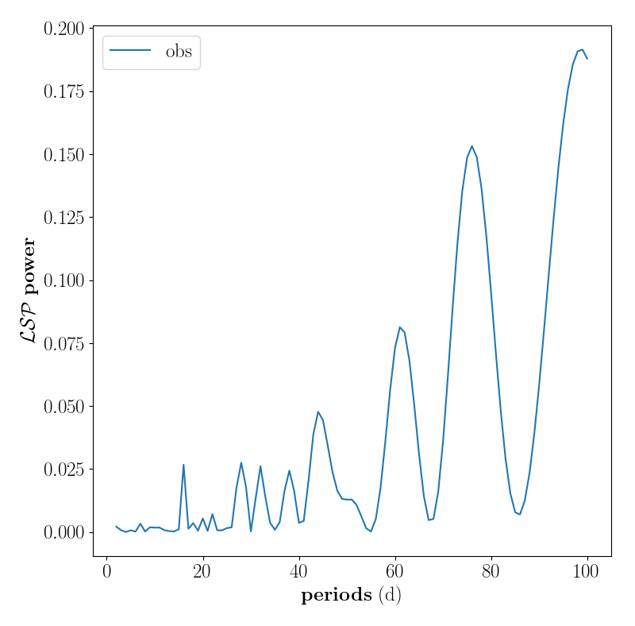
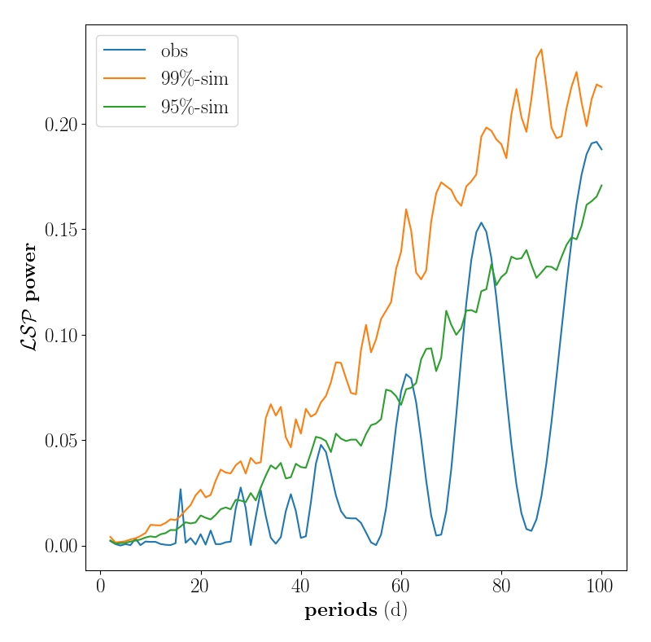

***********************************
Period detection in power law noise
***********************************

Introduction
============
The scripts in this repo establish a method for period detection in unevenly sampled times series assuming power law noise.
The approach is simliar to [1]_, except that uneven sampling of the time serie is taking into account via Monte Carlo simulations.
First, the noise level of the times serie is determined using the PSRESP method.
Then, period detection is carried out using simulated time series with identical sampling and noise level as the data set.
The periodogram of both simulation and data set is compared and only peaks exceeding a certain percentile are regarded as significant periods.

The code is written in accordance with gammapy for more convenient inmplementation. Test-scripts for analysis and plot are also provided.

Background
==========
A general assumption when analysing a time serie in terms of periodicity is that the highest peak of the periodogram denotes the underlying period.
Further peaks are usually traced down to subharmonics, multi-term periodicity, aliasing or a periodicity in the sampling.
Eventually, significance levels in terms of a false alarm probalbility are added to decide whether a peak is high enough to be considered significant, assuming diverging underlying distributions of the periodogram peaks, i.e. [2]_, or using bootstraping, i.e. [3]_.

However, these approaches only hold assuming a white noise null hypothesis.
As soon as the time serie has a non-white noise level, power in the periodogram is shifted such that the highest peaks are due to stochasticity rather than perodicity and the peak of a potential period is burried in the noisy periodogram.

    LombScargle periodogram of a time series with a power-law shaped noise level with power 1.6.
    The time series is superosed by a sinusoid with a period of 16 days.
    
The peak at 16 days may be prominent on a local perspective, but since it is not the global maximum, it won't fulfill any significance criteria based on a static power level for all periods.
Rather, the rising of periodogram power for higher periods must be taken into account.
This can be done by comparing the observed periodogram with the periodogram of simulated time series that have the same noise level as the data set.
In case of an underlying periodicity, only the peak at that period should exceed the simulated periodogram peaks.

    LombScargle periodogram of the observed time serie (blue line) and the 95%- respectively 99%-percentile (green/orange line) of the simulated periodogram distribution.
    The peak at 16 days is correctly detected by the 99%-percentile.

Getting Started
===============
Input
-----

Output
------

Test
----
Tests for analysis and plot can be carried out with the test-scripts.

Example
=======

.. [1] Vaughan, S. (2005). "A simple test for periodic signals in red noise", A&A 431, 391–403
.. [2] Thieler et al. (2016). "RobPer: An R Package to Calculate Periodograms for Light Curves Based on Robust Regression", Journal of Statistical Software, Volume 69, Issue 9
.. [3] Süveges, M. (2012). "False Alarm Probability based on bootstrap and extreme-value methods for periodogram peaks", ISDC Data Centre for Astrophysics, University of Geneva, Switzerland
